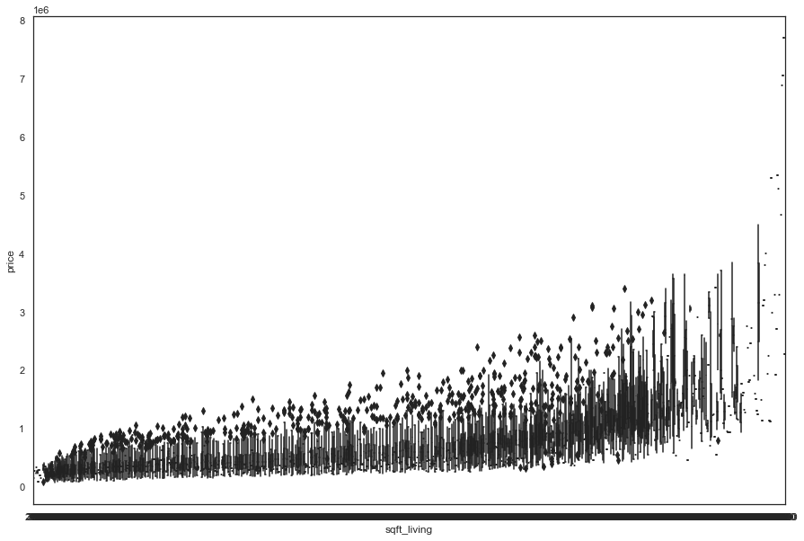

# King County Housing Price Model

Author: David Shin

## Overview

The notebook builds a linear regression model to predict house prices in the King County area. I looked to isolate the top variables that affect price while also generating additional features to better predict prices. Polynominal models were also generated in order to generate a model of better fit. The model has its shortcomings as there can be many factors that are missing from the dataset. 

## Business Problem

Predict the house of a model given the provided features. Discover which attributes of the home are best predictors of price. Accurate predictions of house values are crucial.

## Dataset
King County Housing Data provided by Flatiron School

## Methods

Polynomial data was used to ultimately generate the best fitting model. Initially, the data was run with minor adjustments. Adjustments such as years built, renoved (y/n). There was overall very minimal data cleaning, as there was only one far outlier with 33 bedrooms that most likely was a major anomaly or entry error. Model was further tested with feature selection as there was possibility of refinement. 

## Conclusions

Factors such as bedrooms, bathrooms, renovated, and sq_ft proved to be some of the most impactful variables.

## Further Research
Search for more information on local geographic points that may help with property value (parks,schools,subways,busstops)
Further utilize any other points of interest such as proximity to important office locations/city downtown.
Dig deeper into amount of times house sold to see impact on house value.
Potential additional attributes such as if house has pool
Crime in area vs price of home

## Navigation
Bakeoff_modeling_process.ipynb: Final model containing methods
./data: File containing all data used in project
./images: File containing all images
README.md: Document summarizing methods, results, and further research pending.