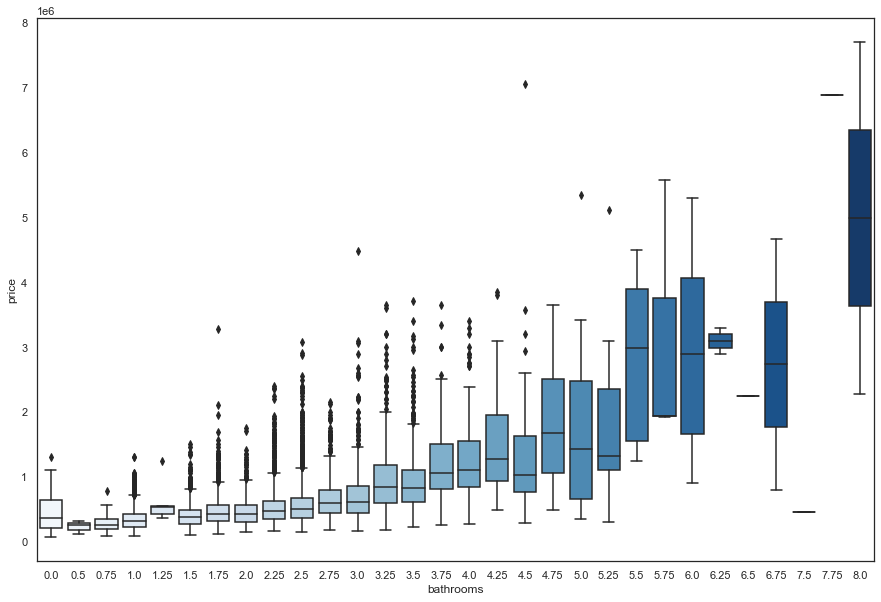
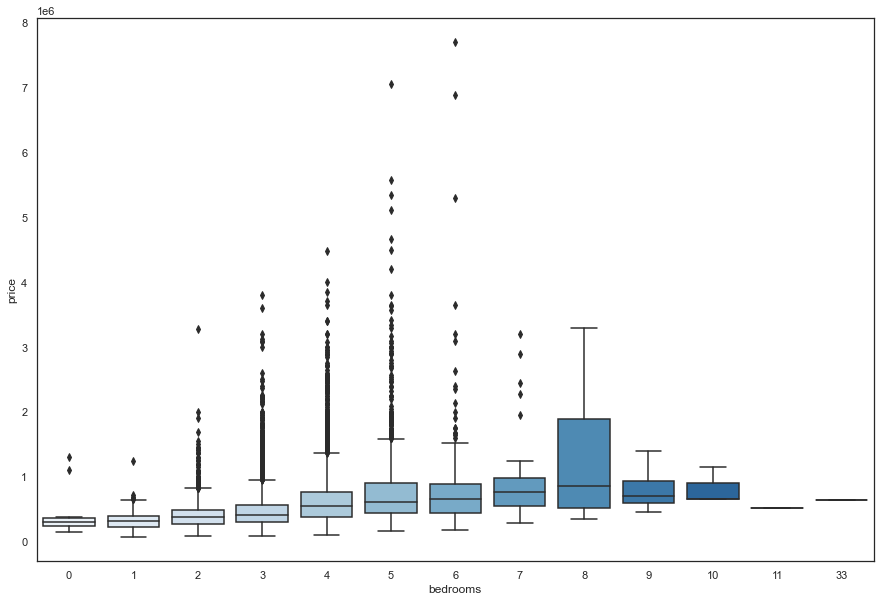
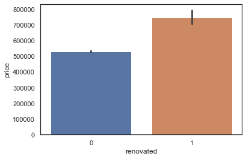
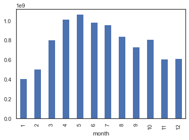

# King County Housing Price Model

David Shin

## Overview

The notebook builds a linear regression model to predict house prices in the King County area. I looked to isolate the top variables that affect price while also generating additional features to better predict prices. Polynominal models were also generated in order to generate a model of better fit. The model has its shortcomings as there can be many factors that are missing from the dataset. 

## Business Problem

Predict the house of a model given the provided features. Discover which attributes of the home are best predictors of price. Accurate predictions of house values are crucial.

## Dataset
King County Housing Data provided by Flatiron School

## Methods

Polynomial data was used to ultimately generate the best fitting model. Initially, the data was run with minor adjustments. Adjustments such as years built, renoved (y/n). There was overall very minimal data cleaning, as there was only one far outlier with 33 bedrooms that most likely was a major anomaly or entry error. Model was further tested with feature selection as there was possibility of refinement. 

## Conclusions

Factors such as bedrooms, bathrooms, renovated, and sq_ft proved to be some of the most impactful variables.

All the factors depict steady growth of price as the factor itself increases. 

Renovations also show an impact on price. Tests show significant differences in mean when comparing houses with and without renovations.

Another variable that was researched was the date of sale. As shown above, there are months throughout the year where more prices tend to be sold over others.

The polynomial model generated provided the lowest RMSE in comparison to the other models generated throughout the analysis. 

## Further Research
- Search for more information on local geographic points that may help with property value (parks,schools,subways,busstops)
- Further utilize any other points of interest such as proximity to important office locations/city downtown.
- Dig deeper into amount of times house sold to see impact on house value.
- Potential additional attributes such as if house has pool
- Crime in area vs price of home

## Navigation
- model.ipynb: Final model containing methods
- lm_final.pickle: Pickle file for final model
- ./data: File containing all data used in project
- ./images: File containing all images
- README.md: Document summarizing methods, results, and further research pending.